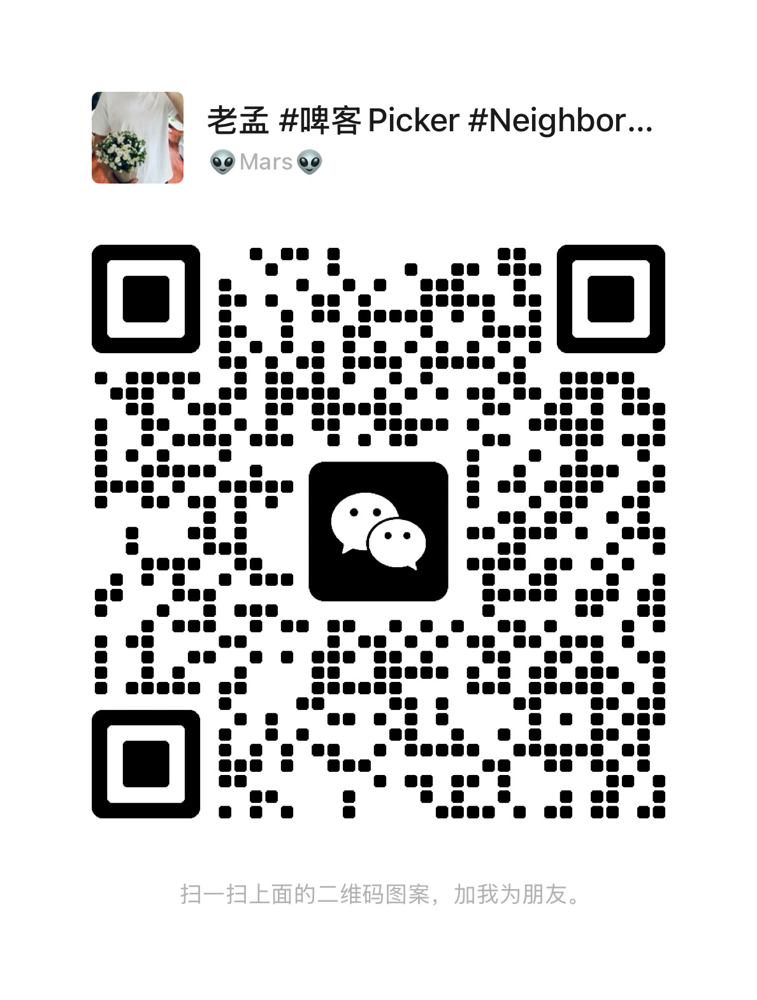

# AgentBridge

[](https://github.com/raysonmeng/agent-bridge/actions/workflows/ci.yml)
[](LICENSE)

[中文文档](README.zh-CN.md)

Local bridge for bidirectional communication between Claude Code and Codex inside the same working session.

The current implementation uses a two-process architecture:

- `bridge.ts` is the foreground MCP client started by Claude Code
- `daemon.ts` is a persistent local background process that owns the Codex app-server proxy and bridge state

This means the foreground MCP process can exit when Claude Code closes, while the background daemon and Codex proxy keep running. When Claude Code starts again, it can reuse the existing daemon automatically.

## What this project is / is not

**This project is:**

- A local developer tool for connecting Claude Code and Codex in one workflow
- A bridge that forwards messages between an MCP channel and the Codex app-server protocol
- An experimental setup for human-in-the-loop collaboration between multiple agents

**This project is not:**

- A hosted service or multi-tenant system
- A generic orchestration framework for arbitrary agent backends
- A hardened security boundary between tools you do not trust

## Architecture

```
┌──────────────┐          MCP stdio          ┌────────────────────┐
│ Claude Code  │ ───────────────────────────▶ │ bridge.ts          │
│ Session      │ ◀─────────────────────────── │ foreground client  │
└──────────────┘                              └─────────┬──────────┘
                                                        │
                                                        │ local control WS
                                                        ▼
                                              ┌────────────────────┐
                                              │ daemon.ts          │
                                              │ bridge daemon      │
                                              └─────────┬──────────┘
                                                        │
                                      ws://127.0.0.1:4501 proxy
                                                        │
                                                        ▼
                                              ┌────────────────────┐
                                              │ Codex app-server   │
                                              └────────────────────┘
```

### Data flow

| Direction | Path |
|------|------|
| **Codex → Claude** | `daemon.ts` captures `agentMessage` → control WS → `bridge.ts` → `notifications/claude/channel` |
| **Claude → Codex** | Claude calls the `reply` tool → `bridge.ts` → control WS → `daemon.ts` → `turn/start` injects into the Codex thread |

### Loop prevention

Each message carries a `source` field (`"claude"` or `"codex"`). The bridge never forwards a message back to its origin.

## Prerequisites

- [Bun](https://bun.sh)
- [Claude Code](https://docs.anthropic.com/en/docs/claude-code) v2.1.80+
- [Codex CLI](https://github.com/openai/codex) with the `codex` command available

## Quick Start

```bash
# 1. Install dependencies
cd agent_bridge
bun install

# 2. Register the MCP server
# Merge .mcp.json.example into ~/.claude/.mcp.json and replace the path
# with your local absolute path:
#   "agentbridge": { "command": "bun", "args": ["run", "/absolute/path/to/agent_bridge/src/bridge.ts"] }

# 3. Start Claude Code and load AgentBridge as a channel (development mode)
claude --dangerously-load-development-channels server:agentbridge
```

> Warning: `--dangerously-load-development-channels` loads a local development channel into Claude Code. This is currently a Research Preview workflow. Only enable channels and MCP servers you trust, because that local process can push messages into your Claude session and participate in the same workspace flow. AgentBridge is intended for local experimentation and development, not for untrusted environments.

`bridge.ts` checks whether a local daemon already exists before continuing.

- If no daemon exists, it starts `daemon.ts`
- If a daemon is already running, it reuses it

`daemon.ts` automatically spawns `codex app-server` in WebSocket mode and can surface the attach command through the Claude channel when needed.

```bash
# 4. Attach to the Codex proxy from another terminal to watch the Codex TUI
codex --enable tui_app_server --remote ws://127.0.0.1:4501
```

> Note: the TUI connects to the bridge proxy port (default `4501`), not the app-server port (`4500`). The bridge transparently forwards traffic and intercepts `agentMessage`.

Codex `agentMessage` items are pushed into the Claude session automatically. Claude can reply back through the `reply` tool.

## File Structure

```
agent_bridge/
├── .github/
│   ├── ISSUE_TEMPLATE/       # Bug report and feature request templates
│   ├── pull_request_template.md
│   └── workflows/ci.yml      # GitHub Actions CI
├── assets/                    # Static assets (images, etc.)
├── src/
│   ├── bridge.ts             # Claude foreground MCP client that ensures the daemon exists and forwards messages
│   ├── daemon.ts             # Persistent background process that owns the Codex proxy and bridge state
│   ├── daemon-client.ts      # Foreground client for the daemon control WS
│   ├── control-protocol.ts   # Shared foreground/background control protocol
│   ├── claude-adapter.ts     # MCP server adapter for Claude Code channels
│   ├── codex-adapter.ts      # Codex app-server WebSocket proxy and message interception
│   └── types.ts              # Shared types
├── CODE_OF_CONDUCT.md
├── CONTRIBUTING.md
├── LICENSE
├── README.md
├── README.zh-CN.md
├── SECURITY.md
├── package.json
└── tsconfig.json
```

## Configuration

| Environment variable | Default | Description |
|----------|--------|------|
| `CODEX_WS_PORT` | `4500` | Codex app-server WebSocket port |
| `CODEX_PROXY_PORT` | `4501` | Bridge proxy port for the Codex TUI |
| `AGENTBRIDGE_CONTROL_PORT` | `4502` | Local control port between `bridge.ts` and `daemon.ts` |
| `AGENTBRIDGE_PID_FILE` | `/tmp/agentbridge-daemon-4502.pid` | Daemon pid file used to avoid duplicate startup |

## Current Limitations

- Only forwards `agentMessage` items, not intermediate `commandExecution`, `fileChange`, or similar events
- Single Codex thread, no multi-session support yet
- Single Claude foreground connection; a new Claude session replaces the previous one

## Roadmap

- **Smart message filtering**: Currently all `agentMessage` items are forwarded in both directions. Many of these are low-value status confirmations or log-reading exchanges. The bridge should support a filtering mode that only forwards key checkpoints — task delegation, review requests, stage completion — and suppresses intermediate chatter.
- **Gemini CLI integration**: Bring [Gemini CLI](https://github.com/google-gemini/gemini-cli) into the bridge as a third agent, enabling three-way communication between Claude Code, Codex, and Gemini in the same session.
- **Explicit addressing**: Support `@codex:` / `@claude:` prefixes to direct a message to a specific agent, rather than broadcasting to all.
- **Turn-based coordination**: A state-machine mode that enforces alternating turns between agents, preventing runaway back-and-forth loops.
- **Multi-session support**: Allow multiple Codex threads and multiple Claude connections simultaneously.
- **Workflow templates**: Built-in patterns for common collaboration scenarios — cross-review (one agent writes, the other reviews), architect + builder (one designs, the other implements), and dual-perspective debugging.

## How This Project Was Built

This project was built collaboratively by **Claude Code** (Anthropic) and **Codex** (OpenAI), communicating through AgentBridge itself — the very tool they were building together. A human developer coordinated the effort, assigning tasks, reviewing progress, and directing the two agents to work in parallel and review each other's output.

In other words, AgentBridge is its own proof of concept: two AI agents from different providers, connected in real time, shipping code side by side.

## Contact

This is my first open-source project! I'd love to connect with anyone interested in multi-agent collaboration, AI tooling, or just building cool things together. Feel free to reach out:

- **Twitter/X**: [@raysonmeng](https://x.com/raysonmeng)
- **Xiaohongshu**: [Profile](https://www.xiaohongshu.com/user/profile/62a3709d0000000021028b7e)
- **WeChat**: Scan the QR code below to add me


